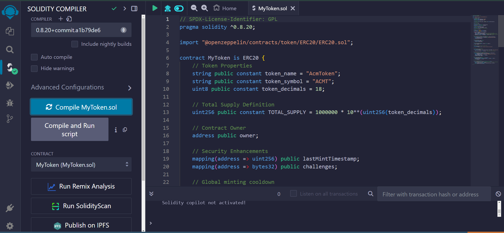
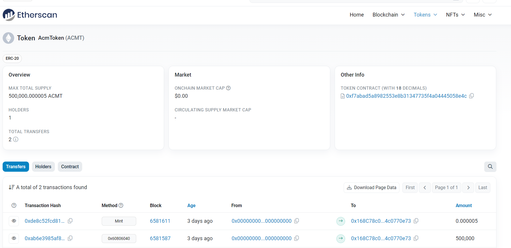

# ERC20 Token Deployment on Ethereum Testnet

This project is a final assignment for the ACM Blockchain Summer Course 2024, designed to deploy a secure ERC20 token on the Ethereum blockchain.

- **TodoToken.sol File**  
  This file contains incomplete code and functions allowing users to design and complete their own tokens.

- **MyToken.sol File**  
  This file contains a simple token contract that incorporates cryptographic mechanisms for controlled minting and features a global cooldown to prevent abuse.

## Features

- **ERC20 Standard Compliance**: The token follows the ERC20 standard, ensuring compatibility with existing Ethereum infrastructure and wallets.
- **Controlled Minting**: Only the contract owner can mint new tokens, with a global cooldown mechanism to prevent frequent minting.
- **Cryptographic Proof**: A simple proof-of-work (PoW) mechanism validates minting requests.
- **Ownership Management**: Functions to transfer ownership of the contract.

## Installation

1. **Prerequisites**:
   - MetaMask extension installed in your browser.
   - An Ethereum account with ETH funds for deployment.

2. **Clone the Repository**:
   ```bash
   git clone https://github.com/Mohta3b/ERC-20-Token-Deployment-on-Ethereum-Testnet
   cd ERC-20-Token-Deployment-on-Ethereum-Testnet
    ```

3. **Open [Remix IDE](https://remix.ethereum.org/)**.

4. **Import the Contract**:
   - Create a new file named `MyToken.sol` in Remix.
   - Copy and paste the code from `MyToken.sol` into Remix.

5. **Compile the Contract**:
   - In the "Solidity Compiler" tab, select the appropriate compiler version.
   - Click "Compile MyToken.sol".

   <div align="center">
     
   </div>

6. **Deploy the Contract**:
   - In the "Deploy & Run Transactions" tab, select "Injected Provider - MetaMask" from the Environment dropdown.
   - Click "Deploy" and confirm the transaction in MetaMask.

7. **Monitor the Token**:
   To monitor transactions and interactions with your token, view your contract on [Etherscan](https://sepolia.etherscan.io/) by entering your contract address in the search bar.

   <div align="center">
     
   </div>
   
   Note: To view the details and transactions of the token displayed in the image above, you can visit [this Etherscan link](https://sepolia.etherscan.io/address/0xf7abad5a8982553e8b31347735f4a04445058e4c).


## License

This project is licensed under the GPL License.
